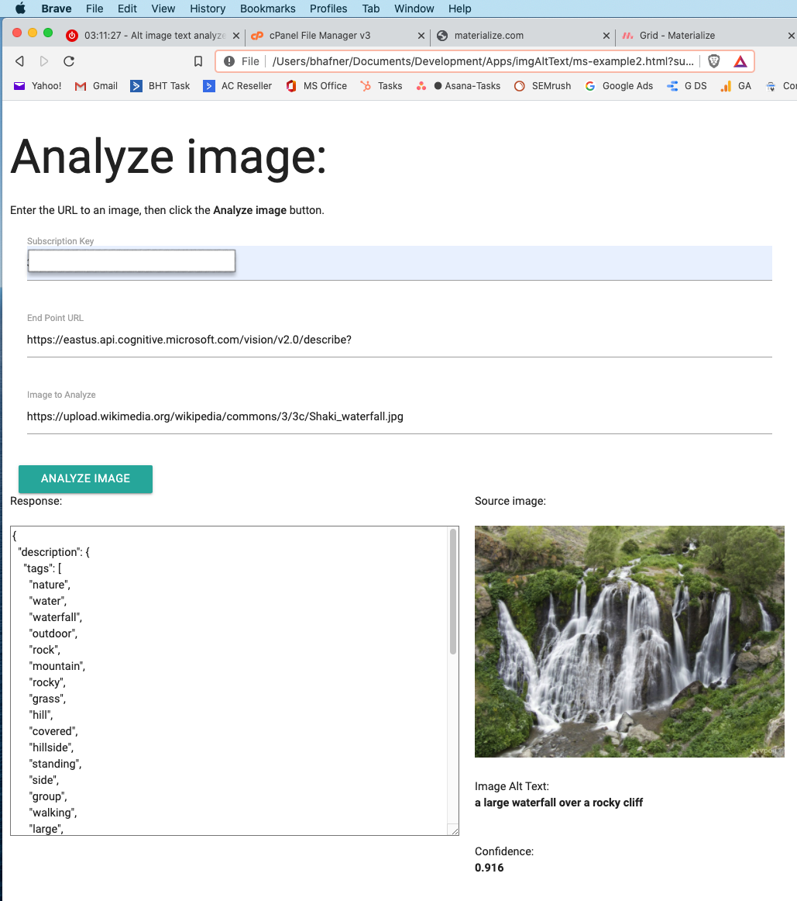

# Img-alt-text-writer

Live URL: https://brianhafnertech.com/Apps/alt-image-text-creator/ms-example2.html

This app generates an alt image text using the Azure Vision API.  I show the image alt text and the confidence level from the API.  If the confidence is high (> 0.8), the image it generates is pretty good.

Background:
----------------------------------------------------
This is a test of the Azure Vision API. I'm planning on using it to generate alt image tags for sites that are missing large numbers of tags.

Technology:
----------------------------------------------------
This is a very simple app using HTML, CSS, Javacript and the Materialize CSS library.

Materialize Library - https://materializecss.com/

Screenshot for Keyword Generator:
--------------------------------

